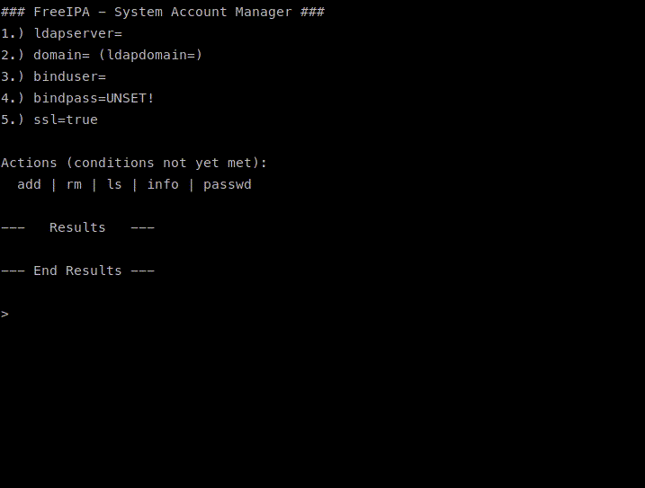

# freeipa-sam
## System Account Manager for FreeIPA  

FreeIPA-SAM is an interactive, menu-driven bash script for lifecycle management of system accounts.  

FreeIPA currently has no intuitive way to create, view, edit, or otherwise manage system accounts. This software aims to fill that gap.  

Usage is pretty straightforward, it is highly-recommended that you leave SSL enabled and configure the prerequisites before attempting an action.  

## Actions  
### `add [username]`  
`add` creates system accounts.  
`add` takes one optional argument of username. If not specified, it asks for it.  
`add` then interactively prompts the user for a password and password expiration date for the new account.  
`add` finally sends a prefilled ldapmodify to the server with the details specified.  

### `rm [username]`  
`rm` removes system accounts.  
`rm` takes one optional argument of username. If not specified, it asks for it.  
**`rm` does NOT ask for confirmation once it knows the username!**  

### `ls`  
`ls` lists the DN of users in the path for system accounts.  

### `info [username]`  
`info` is like `ls` but prints more information. Can be filtered by specifying a username.  

### `passwd [username]`  
`passwd` changes the password and password expiration date for an existing system account.  
`passwd` takes one optional argument of username. If not specified, it asks for it.  
`passwd` interactively prompts for the new password and password expiration date.  
`passwd` finally sends a prefilled ldapmodify to the server.  

### `save`
`save` saves current directory connection settings (excepted `bindpass`) into an RC-file (`${HOME}/.ipa/freeipa-sam.rc`)
If the file exists, variable are automatically read at script startup, and updated in the file on script exit. 
If the file does not exist when the script is started, nothing will be saved unless `save` is run manually. 

PRs and issues welcome, but support cannot be promised.  
Cheers!  
