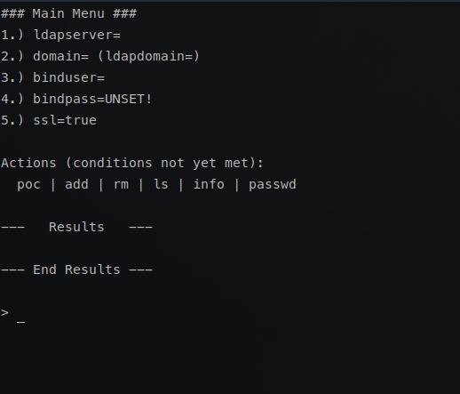

# freeipa-sam
## Service Account Manager for FreeIPA  

FreeIPA-SAM is an interactive, menu-driven bash script for lifecycle management of service accounts.  

FreeIPA currently has no intuitive way to create, view, edit, or otherwise manage service accounts. This software aims to fill that gap.  

Usage is pretty straightforward, it is highly-recommended that you leave SSL enabled and configure the prerequisites before attempting an action.  

PRs and issues welcome, but support cannot be promised.  
Cheers!  
